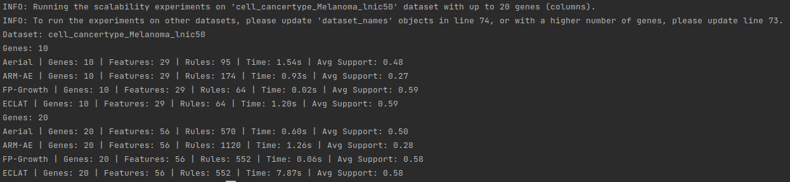
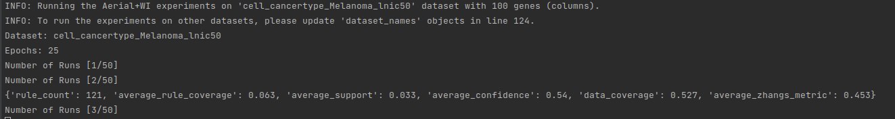
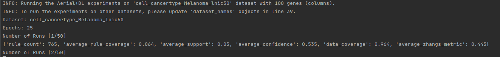

# Discovering Association Rules in High-Dimensional Small Tabular Data

This repository contains the experimental source code for the paper entitled "Discovering Association Rules in
High-Dimensional Small Tabular Data", accepted at the [1st International Workshop on Advanced Neuro-Symbolic
Applications](https://ansya-workshop.github.io/2025/) as part of the [European Conference on Artificial Intelligence 2025](https://ecai2025.org/).

---

## Table of Contents

1. [Datasets](#datasets)
2. [Baseline implementations](#baseline-implementations)
3. [Installing dependencies](#installing-dependencies)
4. [Running scalability experiments on high-dimensional small tabular datasets](#running-scalability-experiments-on-high-dimensional-small-tabular-datasets)
5. [Running fine-tuning experiments](#running-fine-tuning-experiments)
6. [References](#references)

---

## Datasets

The datasets [1, 2, 3, 4] used in the experiments can be found under the `data/discrete` folder. Please see the
references for their original papers.

The datasets are pre-processed according the procedure described in [5], and the pre-processing is (partially) done
by [6]. The pre-processing consists of the trimmed mean of m-values normalization, log transformation (i.e., $log(
x+1)$), and
the expression values were made to have zero mean and unit standard deviation.

We further pre-process the data to enable ARM on gene expression datasets and applied z-score binning with one standard
deviation as the cutoff to discretize values into high, low, and medium gene expression levels.

The source code for discretization is given
under [`src/data_preparation/discretization.py`](src/data_preparation/discretization.py)

---

## Baseline implementations

- **Aerial+ [7]** is implemented using [PyAerial](https://github.com/DiTEC-project/pyaerial) library.
- **Fine-tuned versions of Aerial+**, as proposed in our paper, can be found
  in [`src/fine_tuned_aerial/model_double_loss_pretrained.py`](src/fine_tuned_aerial/model_double_loss_pretrained.py) (
  Aerial+DL) and
  under [`src/experiments/fine-tuning_via_pretrained_weight_initialization.py`](src/experiments/fine-tuning_via_double_loss.py) (
  Aerial+WI).
- **FP-Growth [8]** is implemented using [MLxtend](https://rasbt.github.io/mlxtend/).
- **ECLAT [9]** is implemented using [pyECLAT](https://github.com/jeffrichardchemistry/pyECLAT).
- **ARM-AE [10]** source code is taken from its original [repository](https://github.com/TheophileBERTELOOT/ARM-AE).

---

## Installing dependencies

First, create a python virtual environment:

```
python3 -m venv venv
```

Activate the virtual environment:

```
source venv/bin/activate
```

Install the requirements:

```
pip3 install -r requirements.txt
```

Install [TabPFN [11] extensions](https://github.com/priorlabs/tabpfn-extensions) package:

```
pip install "tabpfn-extensions[all] @ git+https://github.com/PriorLabs/tabpfn-extensions.git"
```

---

## Running scalability experiments on high-dimensional small tabular datasets

The scalability experiments in Section 3 of our paper can be run as follows:

```
python3 -m src.experiments.scalability_on_high_dimensional_data
```

The results are both printed to stdout, as well as saved into a .csv file named "scalability_experiments_
{timestamp}.csv":



---

## Running fine-tuning experiments

The proposed fine-tuning methods in Section 4 can be run as follows.

Aerial+WI implementation described in our paper can be found
under [src/experiments/fine-tuning_via_pretrained_weight_initialization.py](src/experiments/fine-tuning_via_pretrained_weight_initialization.py).
The code can be run via:

```
python3 -m src.experiments.fine-tuning_via_pretrained_weight_initialization 
```

The results are printed to stdout, including the final average:



Aerial+DL implementation is
in [src/experiments/fine-tuning_via_double_loss.py](src/experiments/fine-tuning_via_double_loss.py). The code can be run
via:

```
python3 -m src.experiments.fine-tuning_via_double_loss
```

The results are printed to stdout, including the final average:



---

## References

[1] W. Yang, J. Soares, P. Greninger, E. J. Edelman, H. Lightfoot, S. Forbes, N. Bindal, D. Beare, J. A. Smith, I. R.
Thompson, et al. Genomics of drug sensitivity in cancer (gdsc): a resource for therapeutic biomarker discovery in cancer
cells. Nucleic acids research, 41(D1):D955–D961, 2012.

[2] F. Iorio, T. A. Knijnenburg, D. J. Vis, G. R. Bignell, M. P. Menden, M. Schubert, N. Aben, E. Gonçalves, S.
Barthorpe, H. Lightfoot, et al. A landscape of pharmacogenomic interactions in cancer. Cell, 166(3): 740–754, 2016

[3] H. Gao, J. M. Korn, S. Ferretti, J. E. Monahan, Y. Wang, M. Singh, C. Zhang, C. Schnell, G. Yang, Y. Zhang, et al.
High-throughput screening using patient-derived tumor xenografts to predict clinical trial drug response. Nature
medicine, 21(11):1318–1325, 2015.435

[4] M. J. Garnett, E. J. Edelman, S. J. Heidorn, C. D. Greenman, A. Dastur, K. W. Lau, P. Greninger, I. R. Thompson, X.
Luo, J. Soares, et al. Systematic identification of genomic markers of drug sensitivity in cancer cells. Nature, 483(
7391):570–575, 2012.

[5] S. M. Mourragui, M. Loog, D. J. Vis, K. Moore, A. G. Manjon, M. A. van de Wiel, M. J. Reinders, and L. F. Wessels.
Predicting patient response with models trained on cell lines and patient-derived xenografts
by nonlinear transfer learning. Proceedings of the National Academy of Sciences, 118(49):e2106682118, 2021.

[6] C. Ruiz, H. Ren, K. Huang, and J. Leskovec. High dimensional, tabular deep learning with an auxiliary knowledge
graph. Advances in Neural Information Processing Systems, 36:26348–26371, 2023.

[7] E. Karabulut, P. Groth, and V. Degeler. Neurosymbolic association rule mining from tabular data. In Proceedings of
the 19th Conference on Neurosymbolic Learning and Reasoning (NeSy 2025), Accepted/In Press. Preprint available
at https://arxiv.org/abs/2504.19354.

[8] Han, J. Pei, and Y. Yin. Mining frequent patterns without candidate generation. ACM sigmod record, 29(2):1–12, 2000.

[9] M. J. Zaki, S. Parthasarathy, M. Ogihara, W. Li, et al. New algorithms for fast discovery of association rules. In
KDD, volume 97, pages 283–286, 1997.

[10] T. Berteloot, R. Khoury, and A. Durand. Association rules mining with auto-encoders. In International Conference on
Intelligent Data Engineering and Automated Learning, pages 51–62. Springer, 2024.

[11] N. Hollmann, S. Müller, L. Purucker, A. Krishnakumar, M. Körfer, S. B. Hoo, R. T. Schirrmeister, and F. Hutter.
Accurate predictions on small data with a tabular foundation model. Nature, 637(8045):319–326, 2025.
